# MechHub Nepal 🔧

> **On-demand roadside rescue for Nepal.** Connect stranded drivers with verified mechanics in minutes — with real-time tracking, fixed prices, and eSewa/Khalti/Cash payments.

Built as a full-stack production app demonstrating end-to-end engineering: real-time Socket.io dispatch, JWT auth, persistent SQLite, React mobile-first UI, and a gamified mechanic economy.

---

## Screenshots

| Landing | Driver Home | Radar Search |
|---|---|---|
| 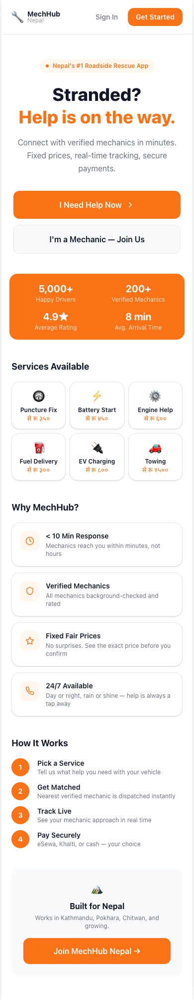 | 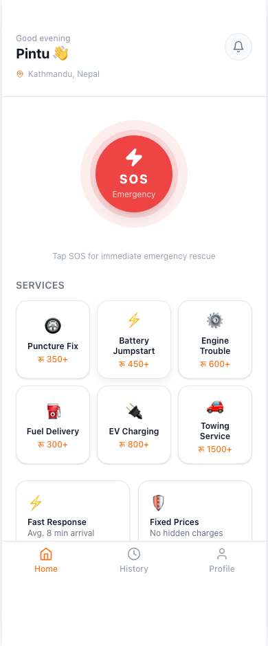 | 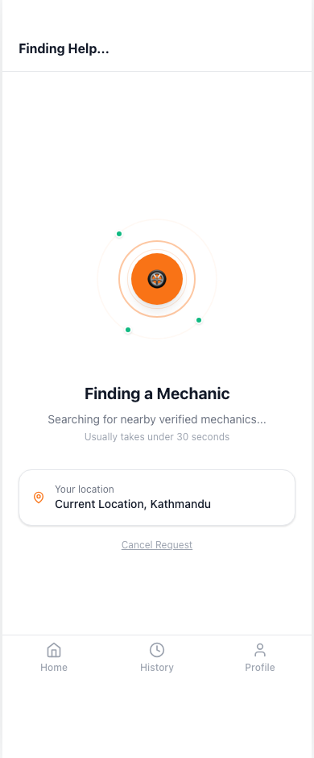 |

| Mechanic Matched | Live Tracking | Payment |
|---|---|---|
| 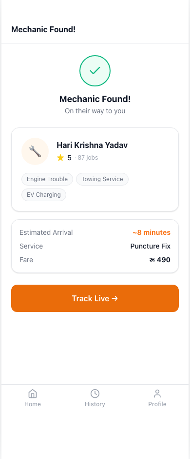 | 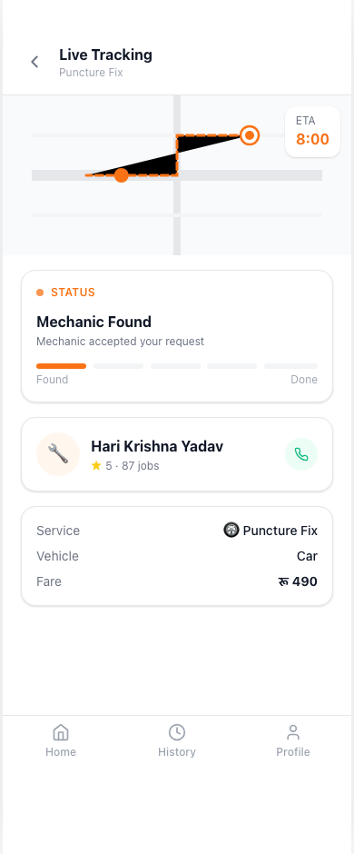 | 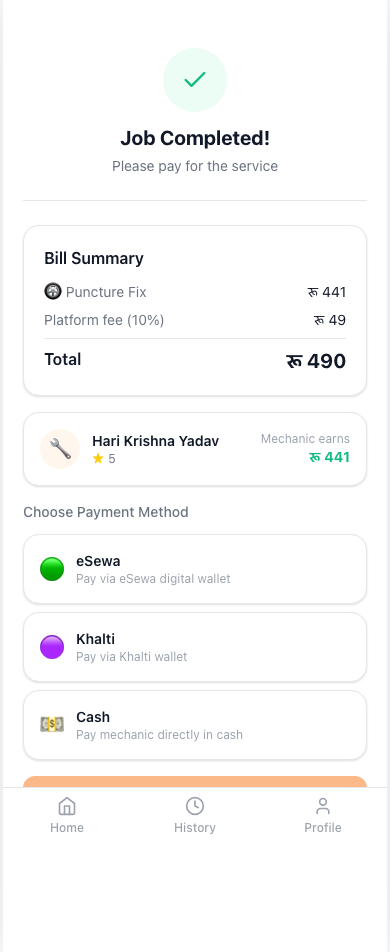 |

| Rating + Tip | Trip History | Mechanic Dashboard |
|---|---|---|
| 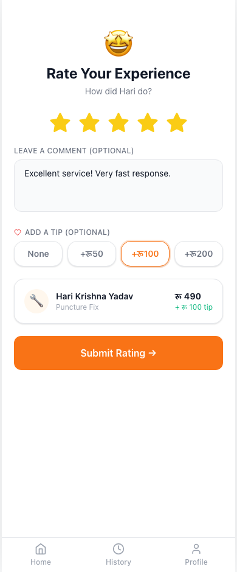 | 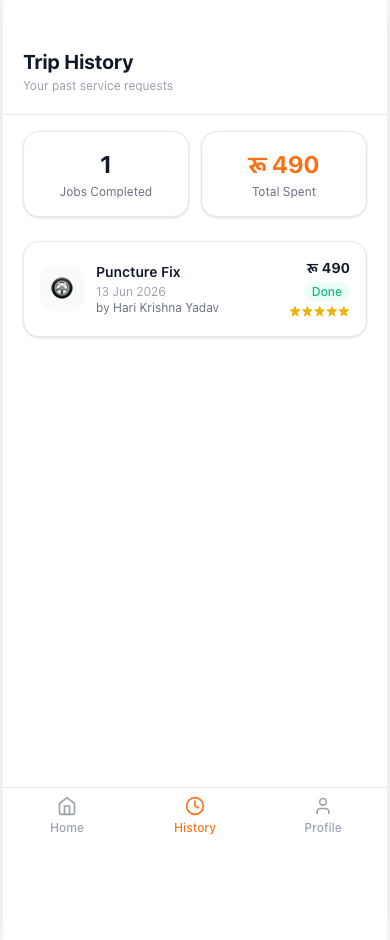 | 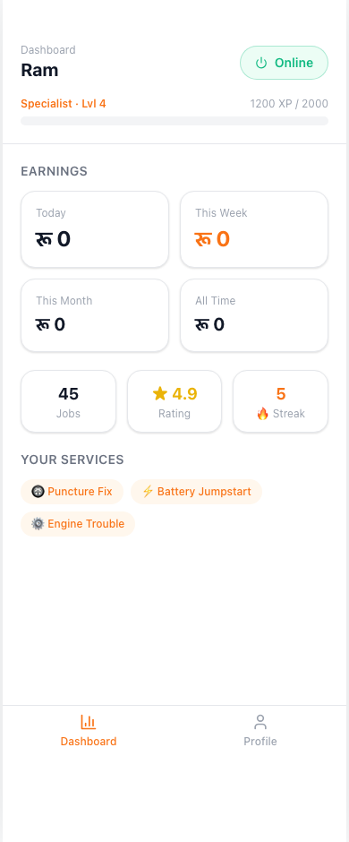 |

| Partner Dashboard | Mechanic Skills | Register |
|---|---|---|
| 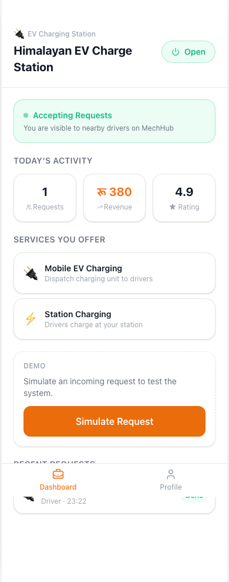 | 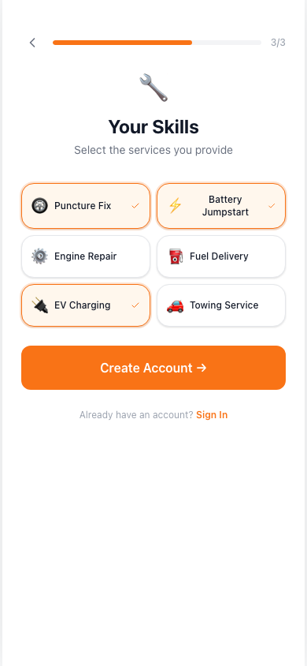 | 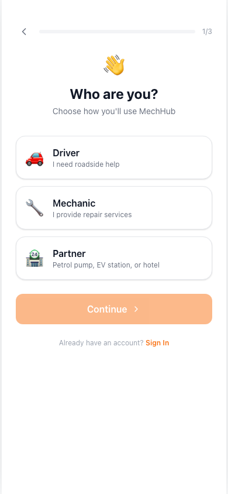 |

---

## Features

| Feature | Status |
|---|---|
| Multi-role auth (Driver / Mechanic / Partner) | ✅ |
| JWT registration & login | ✅ |
| 6 service types with fixed pricing | ✅ |
| Real-time job dispatch via Socket.io | ✅ |
| Auto-assign mechanic (2.5s demo fallback) | ✅ |
| Live tracking with animated SVG map | ✅ |
| ETA countdown timer | ✅ |
| eSewa / Khalti / Cash payment | ✅ |
| Driver rating + tip system | ✅ |
| Mechanic XP / Level / Streak gamification | ✅ |
| Mechanic earnings dashboard (today/week/month) | ✅ |
| Partner dashboard (Petrol / EV / Hotel) | ✅ |
| Trip history | ✅ |
| 3 seeded demo mechanics | ✅ |
| White minimal mobile-first UI | ✅ |

---

## Tech Stack

### Backend
| Tech | Role |
|---|---|
| **Node.js + Express** | REST API server |
| **Socket.io** | Real-time job dispatch & status updates |
| **sql.js** (WebAssembly SQLite) | Persistent database, zero native deps |
| **bcryptjs** | Password hashing |
| **jsonwebtoken** | Stateless JWT auth |

### Frontend
| Tech | Role |
|---|---|
| **React 18** | Component-based UI |
| **Vite** | Dev server + bundler |
| **Tailwind CSS** | Custom `mh-*` design tokens, white minimal palette |
| **React Router v6** | Client-side routing with role-based guards |
| **Axios** | HTTP client with JWT interceptor |
| **socket.io-client** | Real-time updates |
| **lucide-react** | Icon library |

---

## Project Structure

```
mechhub-nepal/
├── server/
│   ├── index.js           ← Express + Socket.io entry point (port 3002)
│   ├── database.js        ← sql.js WASM + better-sqlite3-compatible shim + seeding
│   ├── constants.js       ← Service types, fares, XP, level thresholds
│   ├── middleware/
│   │   └── auth.js        ← JWT verify middleware
│   └── routes/
│       ├── auth.js        ← POST /register, POST /login, GET /me
│       ├── jobs.js        ← Job CRUD, accept, status, payment, rating
│       ├── mechanics.js   ← Dashboard, nearby, toggle online, location
│       ├── users.js       ← Profile, vehicle management
│       └── partners.js    ← Partner dashboard, toggle open
│
└── client/
    ├── src/
    │   ├── api/index.js          ← Axios instance + all API calls
    │   ├── context/
    │   │   ├── AuthContext.jsx   ← Global auth state (login/logout/hydrate)
    │   │   └── SocketContext.jsx ← Socket.io connection + job event listeners
    │   ├── components/
    │   │   ├── Layout.jsx        ← Mobile shell + role-based bottom nav
    │   │   └── JobPingOverlay.jsx ← 60s countdown mechanic job alert
    │   ├── constants.js          ← Services, vehicle types, level names
    │   └── pages/
    │       ├── Landing.jsx
    │       ├── Login.jsx
    │       ├── Register.jsx      ← Multi-step: role → info → role-specific
    │       ├── driver/           ← Home, Request, Tracking, Payment, Complete, History
    │       ├── mechanic/         ← Dashboard, ActiveJob
    │       └── partner/          ← Dashboard
    ├── tailwind.config.js        ← Custom mh-* color tokens
    └── vite.config.js            ← Proxy /api → localhost:3002
```

---

## Getting Started

### Prerequisites
- Node.js v18+ (tested on v24)
- npm

### Install

```bash
git clone https://github.com/pintuyadav5468/mechhub-nepal.git
cd mechhub-nepal

# Install backend deps
cd server && npm install

# Install frontend deps
cd ../client && npm install
```

### Run

Open two terminals:

```bash
# Terminal 1 — Backend (port 3002)
cd server && node index.js

# Terminal 2 — Frontend (port 5173)
cd client && npm run dev
```

Then open **http://localhost:5173**

### Demo Accounts

Three mechanics are seeded automatically on first run (password: `demo123`):

| Name | Email | Level | Rating | Specialties |
|---|---|---|---|---|
| Ram Prasad Sharma | ram@mechhub.np | Lv4 Specialist | ★4.9 | Puncture, Battery, Engine |
| Shyam Bahadur Thapa | shyam@mechhub.np | Lv3 Tech | ★4.7 | Puncture, Battery, Fuel |
| Hari Krishna Yadav | hari@mechhub.np | Lv6 Master | ★5.0 | Engine, Towing, EV Charge |

Register a new **Driver** account to test the full request flow.

---

## API Reference

### Auth
| Method | Endpoint | Description |
|---|---|---|
| POST | `/api/auth/register` | Create account (driver/mechanic/partner) |
| POST | `/api/auth/login` | Login, returns JWT |
| GET | `/api/auth/me` | Get current user |

### Jobs
| Method | Endpoint | Description |
|---|---|---|
| POST | `/api/jobs` | Driver creates service request |
| GET | `/api/jobs/current` | Driver's active job |
| GET | `/api/jobs/history` | Driver's completed jobs |
| GET | `/api/jobs/:id` | Get job by ID |
| PATCH | `/api/jobs/:id/accept` | Mechanic accepts job |
| PATCH | `/api/jobs/:id/status` | Update job status |
| PATCH | `/api/jobs/:id/payment` | Record payment method |
| PATCH | `/api/jobs/:id/rate` | Driver rates mechanic + tip |

### Mechanics
| Method | Endpoint | Description |
|---|---|---|
| GET | `/api/mechanics/nearby` | All online mechanics |
| GET | `/api/mechanics/dashboard` | Earnings, XP, recent jobs |
| PATCH | `/api/mechanics/toggle` | Go online / offline |
| PATCH | `/api/mechanics/location` | Update GPS position |

---

## Service Pricing

| Service | Base Price | Bike (×1.0) | Car (×1.4) | EV (×1.3) |
|---|---|---|---|---|
| Puncture Fix | रू 350 | रू 350 | रू 490 | रू 455 |
| Battery Jumpstart | रू 450 | रू 450 | रू 630 | रू 585 |
| Engine Trouble | रू 600 | रू 600 | रू 840 | रू 780 |
| Fuel Delivery | रू 300 | रू 300 | रू 420 | रू 390 |
| EV Charging | रू 800 | रू 800 | रू 1,120 | रू 1,040 |
| Towing Service | रू 1,500 | रू 1,500 | रू 2,100 | रू 1,950 |

10% platform fee included. Mechanic earns 90%.

---

## Mechanic Level System

| Level | Name | XP Required |
|---|---|---|
| 1 | Rookie | 0 |
| 2 | Helper | 300 |
| 3 | Tech | 700 |
| 4 | Specialist | 1,200 |
| 5 | Expert | 2,000 |
| 6 | Master | 3,000 |
| 7 | Elite | 5,000 |
| 8 | Legend | 8,000 |
| 9 | Hero | 12,000 |
| 10 | Champion | 18,000 |

XP is awarded per job: Puncture +50, Battery +70, Engine +100, Fuel +40, EV Charge +90, Towing +120.

---

## Key Design Decisions

**sql.js over better-sqlite3** — Pure WebAssembly SQLite with a better-sqlite3-compatible shim (`.prepare().get()`, `.all()`, `.run()`) avoids native gyp compilation failures on Node.js v24+, while keeping synchronous route code unchanged.

**JavaScript Proxy for async DB init** — `const { db } = require('./database')` works synchronously in route files even though the DB is initialized asynchronously, because `db` is a Proxy that defers all property access to the real CompatDB instance after `initDB()` resolves.

**Auto-assign fallback** — If no real mechanic socket accepts within 2.5 seconds, the server auto-assigns the highest-rated available mechanic. This makes solo demos work without needing two browser windows.

**Socket.io room-free dispatch** — Job pings are emitted directly to individual mechanic sockets via a `Map<userId, socket>` maintained on the server, avoiding room management overhead.

**White minimal design** — Custom Tailwind `mh-*` palette: white background, `#F97316` orange accent (Nepal energy), `#10B981` green for online/success, `#EF4444` red for SOS/danger. Mobile-first at 390px max-width.

---

## Database Schema

```sql
users           — id, name, email, phone, password_hash, role, avatar_url
vehicles        — id, user_id, type (bike/car/ev), make, model, plate
mechanic_profiles — id, user_id, xp, level, rating, jobs_done, streak, is_online, specialties, lat, lng
partner_profiles  — id, user_id, partner_type, business_name, is_open
service_requests  — id, driver_id, mechanic_id, service_type, vehicle_type, status,
                    location, fare, pay_method, tip, driver_rating, timestamps
earnings          — id, mechanic_id, request_id, amount, created_at
```

---

## Author

**Pintu Yadav** — [@pintuyadav5468](https://github.com/pintuyadav5468)

Full-stack portfolio project demonstrating real-time Node.js + React engineering for a Nepal-specific market problem.

---

## License

MIT
